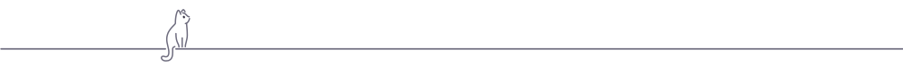

<!-- patodavida :duck: -->

<div align="center">

# Denver

this repository is not intended to be a showcase for my customizations or anything like that.<br>
it's just a repository that i'm going to use (if i keep it) with some of<br>
the configurations that i use on a daily basis in my linux environment.

</div>

---

- **distro**: [debian - bullseye](https://www.debian.org/)
- **shell**: [fish](https://github.com/fish-shell/fish-shell)
- **wm**: [awesome wm](https://github.com/awesomewm/awesome)
- **terminal emulator**: [alacritty](https://github.com/alacritty/alacritty)
- **terminal editor**: [micro](https://github.com/zyedidia/micro)
- **graphic editro**: [sublime text 4](https://www.sublimetext.com/download)
- **font family**: [maple mono nf](https://github.com/subframe7536/maple-font)

---

| | |
| :---: | :---: |
|  |  | |
|  |  | |

---

### Extras

```bash
curl -fsSL https://raw.githubusercontent.com/oh-my-fish/oh-my-fish/master/bin/install | sh
```

```bash
curl -fsSL https://raw.githubusercontent.com/ohmybash/oh-my-bash/master/tools/install.sh | sh
```

```bash
curl --proto '=https' --tlsv1.2 -sSf https://sh.rustup.rs | sh
```

---

### NOTES

see the [NOTES](./notes.md) for some crucial notes

---

### TODO

See TODO [here](./TODO.md)


<div align="center">

</div>

